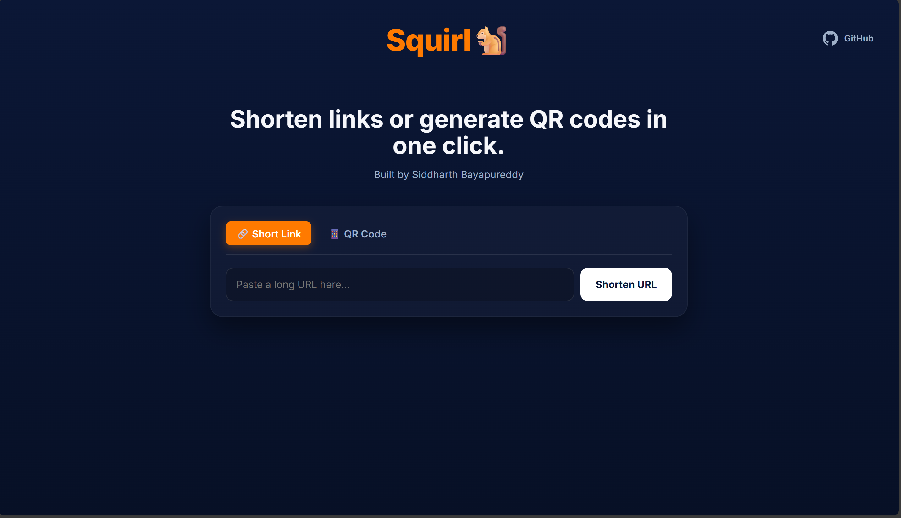

# Squirl 🐿️

### A simple, fast URL shortener and QR code generator.

## Squirl is a lightweight web app built with Python (Flask) along with HTML to provide a clean UI to:
 - Shorten any long URL using is.gd API
 - Generates a QR code for the shortened link

#### Checkout the website
#### https://squirl.vercel.app/



## Features:


#### 1. Dual Mode: Easily switch between "Short Link" and "QR Code" generation using a clean tabbed interface.

#### 2. Instant Results: The shortened link or QR code is generated and displayed immediately on the same page.

#### 3. Copy & Download: Quickly copy the short link to your clipboard or download the QR code as a PNG.

#### 4. Simple & Fast: No database, no signups. Just paste, click, and share.


## Tech Stack
    - Backend - Python & Flask 
    - Frontend - HTML/CSS
- Core Libraries
    - requests: For making API calls to is.gd to shorten url.
    - qrcode: For generating QR code images
    - Flask: Framework for creating endpoints

## Project Structure

    Squirl/
    ├── main.py             # The main Flask server (routes, logic)
    ├── url_shortener.py    # Module to handle is.gd API calls
    ├── qr_generator.py     # Module to generate the QR code image
    ├── requirements.txt    # All Python dependencies
    └── templates/
        └── index.html      # The single-page HTML frontend


## How to run locally?

### 1. Prerequisites

Python 3.x

pip (Python package installer)

### 2. Setup

Clone the repository (or download the files).
Create a virtual environment:

#### On Windows
```bash
python -m venv venv
venv\Scripts\activate
```

#### On macOS/Linux
```bash
python3 -m venv venv
source venv/bin/activate
```

#### Install the dependencies:
```
pip install -r requirements.txt
```

### 3. Run the App

Start the Flask server:
```
python main.py
```

Open your browser and go to the address shown in the terminal, usually:
http://127.0.0.1:5000
